# Public Safety Reporting Platform

🚨 **Welcome to the Public Safety Reporting Platform!** 🚔

## Overview

The Public Safety Reporting Platform is a comprehensive software solution designed to enhance community safety and facilitate efficient incident reporting and management. It empowers citizens to report various incidents, ranging from crimes and emergencies to safety hazards, through an intuitive user interface. Leveraging advanced technologies such as geolocation services and multimedia attachments, users can provide detailed information about incidents, enabling prompt and accurate response from authorities.

## Features

📋 **Key Features:**

- Incident Reporting: Report various incidents, including crimes, emergencies, and safety hazards.
- Case Assignment: Assign reported cases to the appropriate in-charge based on the pin code provided by the user.
- Educational Resources: Access educational materials, safety tips, and community alerts to stay informed.
- Chatbot Assistance: Interact with the chatbot for guidance and support in resolving queries about the platform.
- Feedback Mechanism: Provide feedback on the platform's functionality and user experience.

## Installation

⚙️ **Installation Steps:**

1. Clone the repository: `git clone https://github.com/vipindagar7/crime-report-portal.git`
2. Install dependencies: `pip install -r requirements.txt`
3. Apply migrations: `python manage.py migrate`
4. Start the server: `python manage.py runserver`

## Usage

🔧 **Usage Instructions:**

1. Register/Login to the platform using your credentials.
2. Report incidents by providing detailed information and submitting the report.
3. Access educational resources, interact with the chatbot, and provide feedback as needed.
4. Monitor the status and progress of reported incidents through the platform.
## 🖼️ Preview

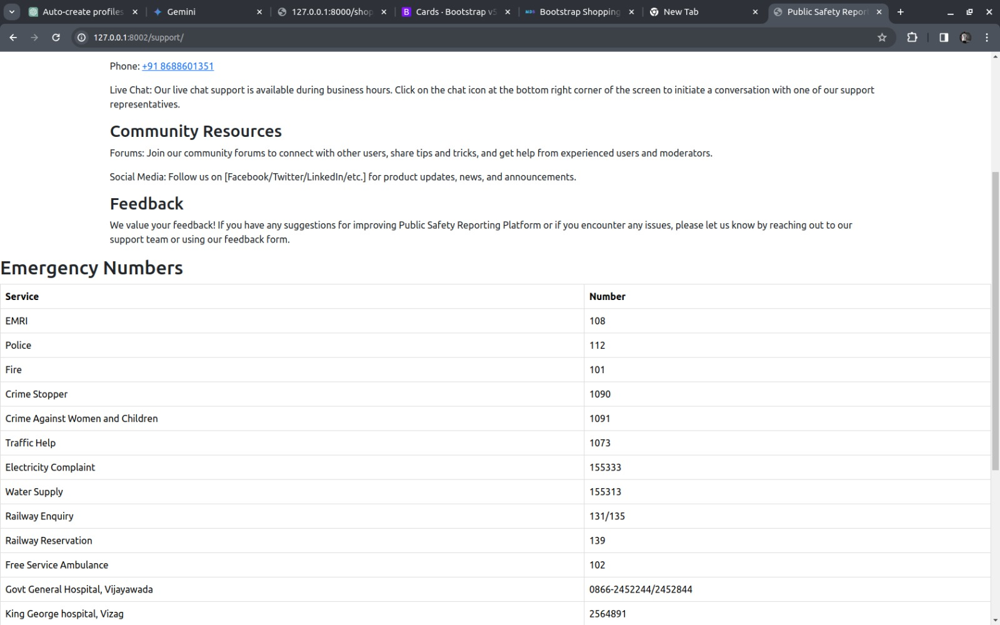
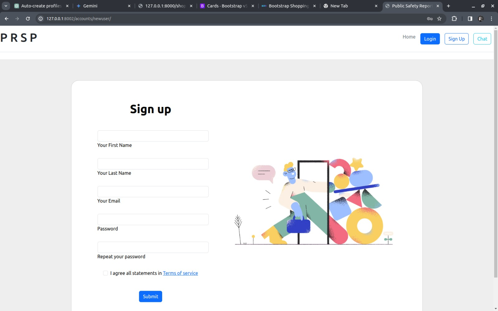
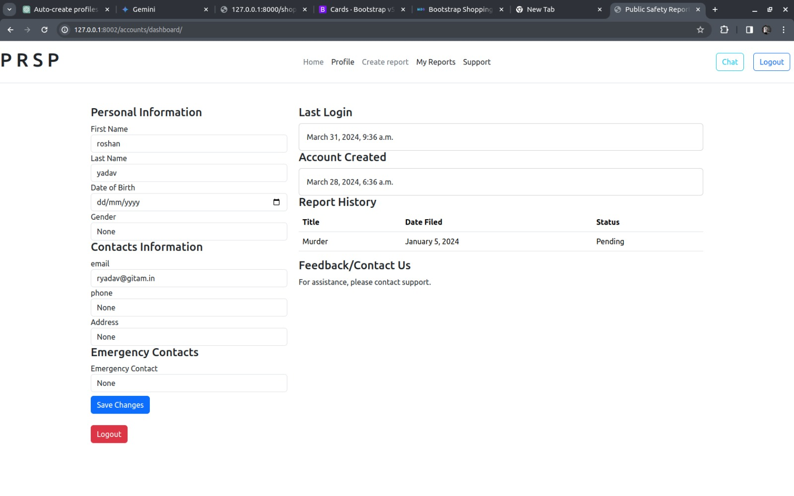
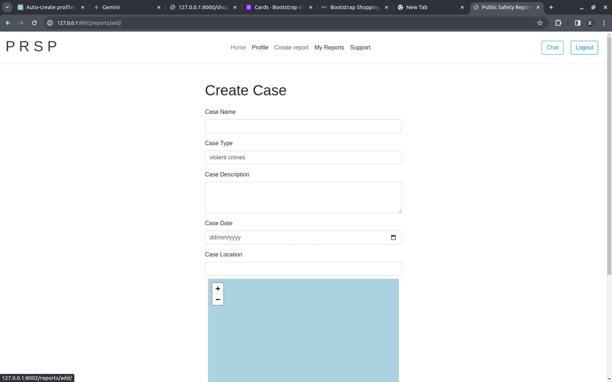
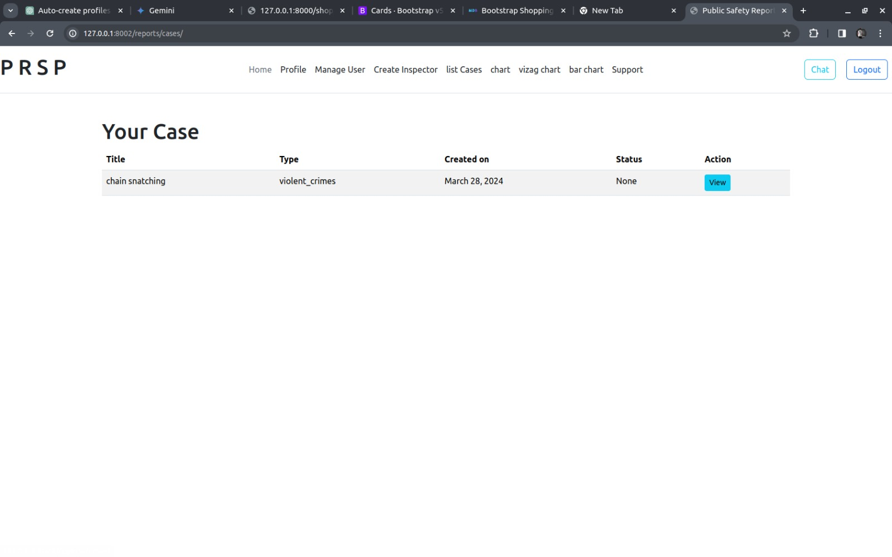
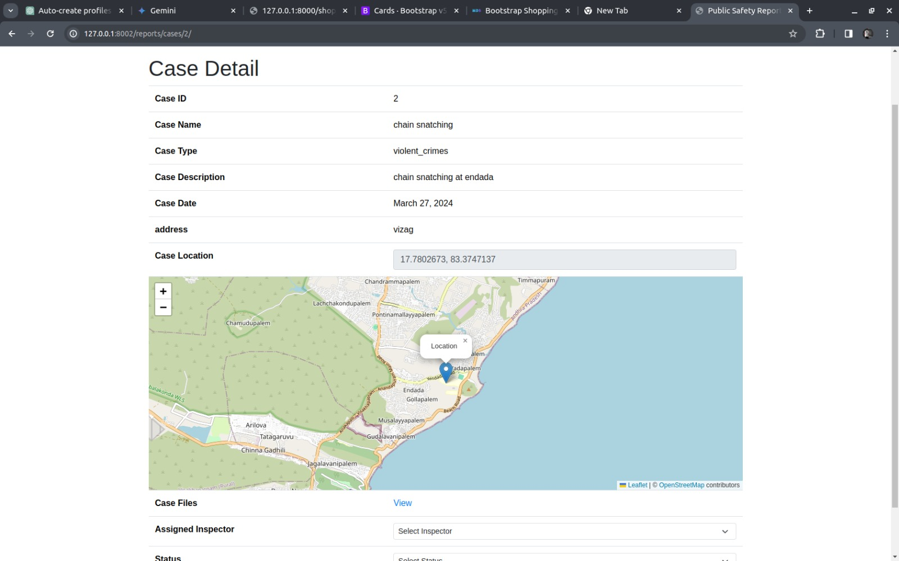

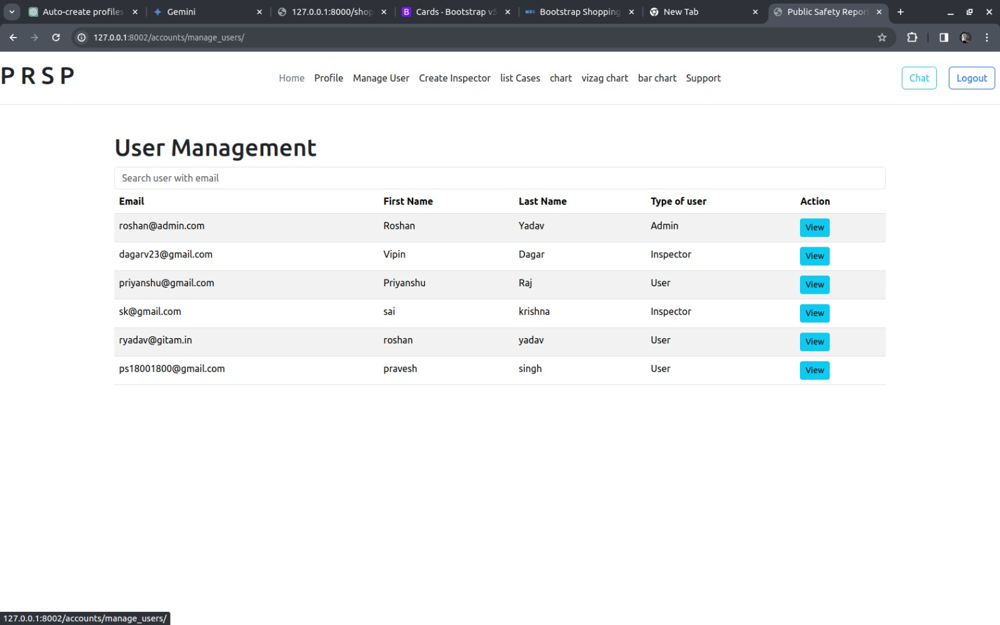
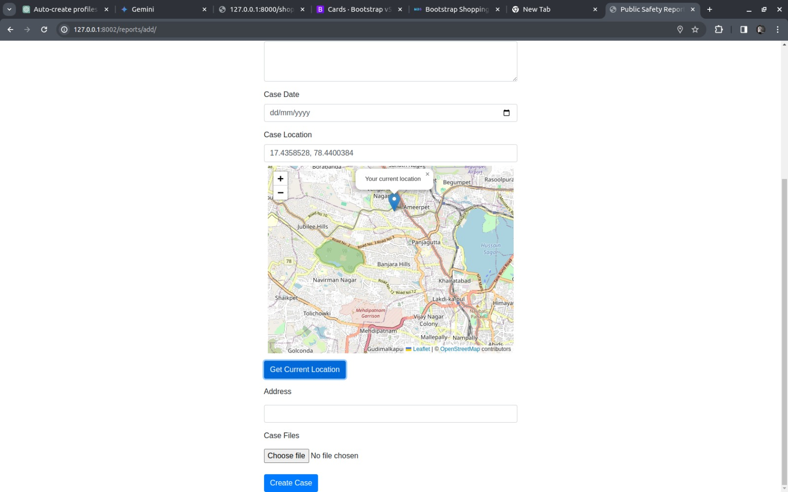
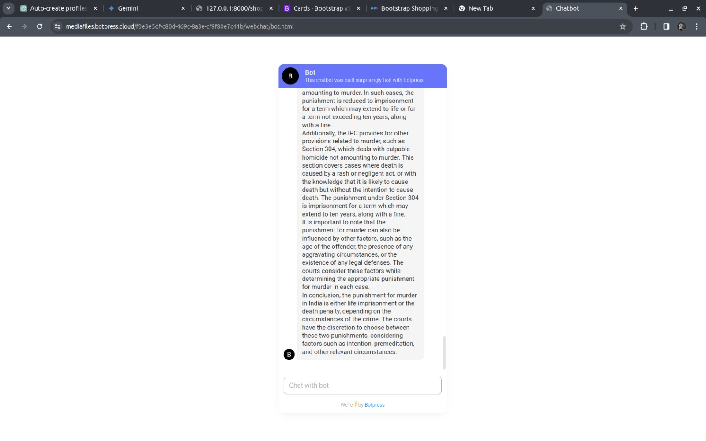
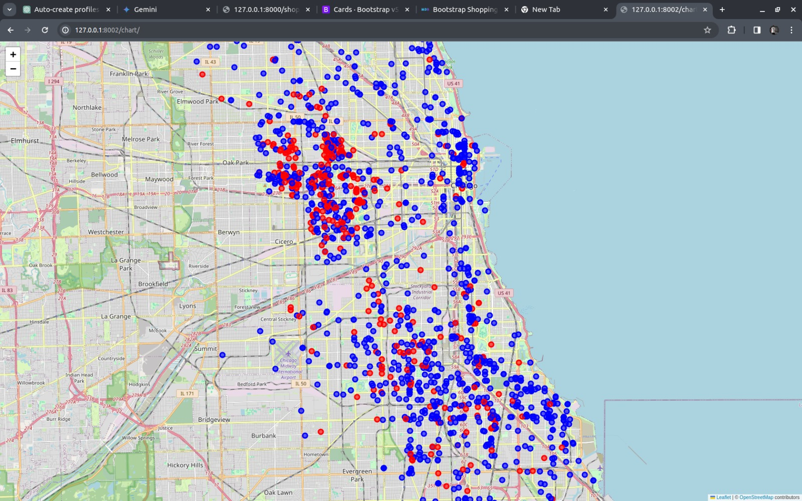
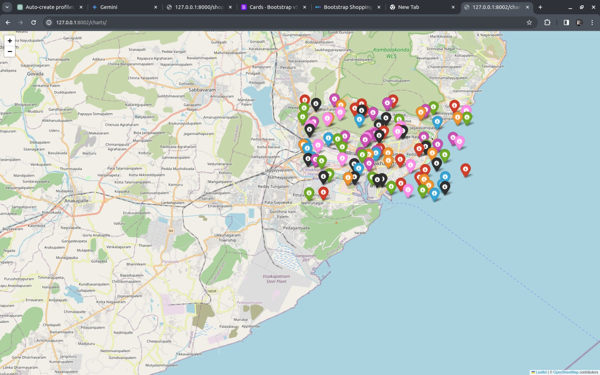
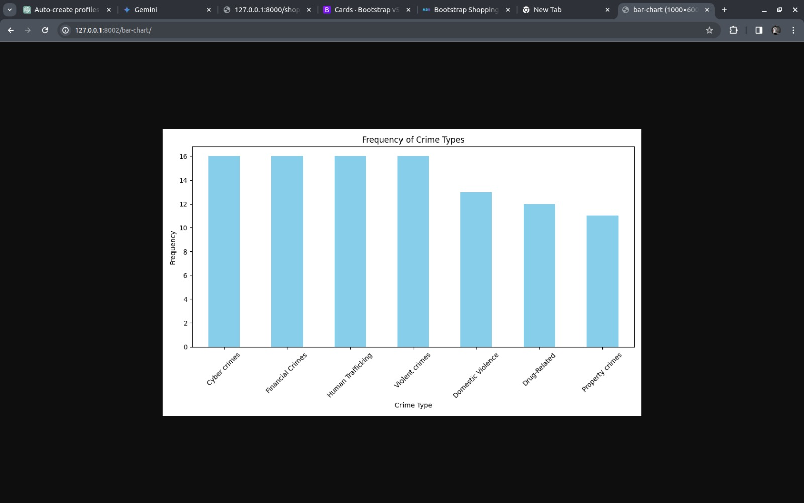
## Contributing

👥 **Contributing Guidelines:**

- Fork the repository and create a new branch for your contributions.
- Make your changes and submit a pull request with a clear description of the changes made.
- Ensure that your code follows the project's coding standards and guidelines.

## License

📄 **License:**

This project is licensed under the MIT License - see the [LICENSE](LICENSE) file for details.
